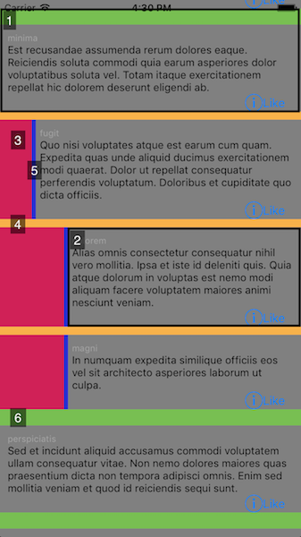
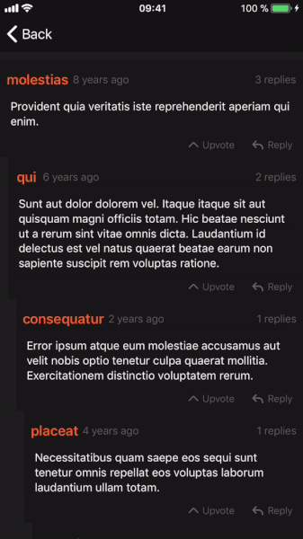

# SwiftyComments


<p align="center">
    <a href="https://travis-ci.org/tsucres/SwiftyComments">
      
    </a>
    
    <a href="https://opensource.org/licenses/MIT">
      
    </a>
</p>


UITableView based component designed to display a hierarchy of expandable/foldable comments.


## Installation

### Manually

Just copy the `.swift` files from the [`SwiftyComments/Classes`](SwiftyComments/Classes) folder in your project.

### Cocoapod

Add the following line to your Podfile:


```ruby
pod 'SwiftyComments', :git => 'https://github.com/tsucres/SwiftyComments.git'
```

## Usage

### Overview

Basically, all you have to do is 

1. define a view for your comments (typically, a view containing the poster's name, a datetime, the content of the comment, ...). This view will be the main subview of each `CommentCell` (subclass of `UITableViewCell`);
2. customize the appearance of the tableView through the available properties of the `CommentCell` class;
3. feed your models to the `CommentsViewController `.


### Details

Here are more details about the previous steps: 

##### 1) Build your CommentCell

A `CommentCell` is basically 1 UIView showing your comment + an indentation. Here's a basic implementation: 

```swift
class YourCommentCell: CommentCell {
	
	override init(style: UITableViewCellStyle, reuseIdentifier: String?) {
		super.init(style: style, reuseIdentifier: reuseIdentifier)
		
		// YourCommentView is a UIView aimed to contain all the info about a comment (poster's name, date, body, ...)
		self.commentViewContent = YourCommentView()
		
		// Customisation...
		// ...
	}
	required init?(coder aDecoder: NSCoder) {
		fatalError("init(coder:) has not been implemented")
	}
}

```

##### 2) Customize your cell

The surroundings of your comment view (such as the indentation, the margins) are customizable through several properties of the `CommentCell` class : 

```swift
	
	// Margin on top of a root comment
	self.rootCommentMarginColor = ...
	self.rootCommentMargin = ...
	// Margin on top of any non-root comment
	self.commentMarginColor = ...
	self.commentMargin = ...
	// Space on the left of any indented comment
	self.identationColor = ...
	// Vertical line between the indentation space and the comment
	self.indentationIndicatorColor = ...
	self.indentationIndicatorThickness = ...
	// Whether to continue the indentyation indicator on all the child comments or not
	self.extendIndentationIndicators = ...
	// thickness of the indentation offset per level
	self.indentationUnit = ...

```


##### 3) Load the data

The `CommentsViewController` class inherits from `UITableViewController` and takes care of loading your cells. All you have to do is fill the `allComments` property with your models and override the `tableView(_:cellForRowAt:)` method: 


```swift

class YourCommentsViewController: CommentsViewController {
	private let commentCellId = "commentCellId"
	var allComments: [YourCommentModel] = [] // All the comments (nested, not in a linear format)
	
	override func viewDidLoad() {
		super.viewDidLoad()
		
		tableView.register(SimpleCommentCell.self, forCellReuseIdentifier: commentCellId)
		currentlyDisplayed = allComments // Assuming your models are loaded in allComments
    }
    
	override func tableView(_ tableView: UITableView, cellForRowAt indexPath: IndexPath) -> CommentCell {
		let commentCell = tableView.dequeueReusableCell(withIdentifier: commentCellId, for: indexPath) as! YourCommentCell
		let comment = currentlyDisplayed[indexPath.row] as! YourCommentModel
		commentCell.level = comment.level
		// commentCell.body = ...
		return commentCell
    }
}

```

**Note** that your model must satisfy the `AbstractComment` protocol: 

```swift
public protocol AbstractComment: class {
    var replies: [AbstractComment]! { get set }
    var level: Int! { get set }
    weak var replyTo: AbstractComment? { get set }
}
```


By default, when a comment is expanded, the tableView will scroll to make the replies visible. You can turn this feature off throught the property `makeExpandedCellsVisible`.

Additionally, you can start with a fully-expanded tableView by setting the `fullyExpanded` property to `true`.

### Overall structure of the tableview

The following image shows the structure of the tableView:



- **`1`** shows the whole `CommentCell`
- **`2`** is the `UIView` assigned to the `commentViewContent` property of the cell
- **`3`** is the *indentation* space, which you can personalize through the `indentationUnit`and `identationColor` properties of the `CommentCell`
- The color and the thickness of **`4`** are personalizable through the properties `commentMarginColor` and `commentMargin` of the `CommentCell`
- **`5`** is similarly modifiable through `indentationIndicatorColor` and `indentationIndicatorThickness`
- same for **`6`** with `rootCommentMarginColor` and `rootCommentMargin`


### AttributedStrings

You can easily add special styles (titles, links, paragraph spacing, bold/italic font for some words, ..) in your commentContentView using a `UITextView` with a `NSAttributedString`. 

Though, if your comment contents are in html format you may want to reconsider your eventual plan of using the  `DocumentReadingOptionKey.documentType: NSAttributedString.DocumentType.html` option. Even if this way is really simple and straightforward, it's not efficient and takes a long time (.15 - .2 s in my experience) to load the string. Since the height of the cells are automatically calculated based on their content, that delay leads to glitches/lagging.


An alternative (illustrated in the `HNCommentsViewController` example) is to parse the html yourself and build the NSAttributedString by adding the attributes "manually". 

This may be more difficult to implement depending on how complex the format of your comments is, but it's waaaay more efficient.

If you don't trust me, go in the [`HNCommentsViewController.swift`](Example/SwiftyComments/HNCommentsViewController.swift) and uncomment the part that loads the comments the easy way...

The example makes use of [SwiftScanner](https://github.com/malcommac/SwiftScanner) to parse the html of the hackernews comments. Check the [`HNCommentContentParser.swift`](Example/SwiftyComments/HNCommentContentParser.swift) file for more details on how the AttributedStrings are built.

### CommentsViewDelegate

```swift
public protocol CommentsViewDelegate: class {
    func commentCellExpanded(atIndex index: Int)
    func commentCellFolded(atIndex index: Int)
}
```

You can implement this protocol and correctly set the `delegate` attribute of `CommentsViewController` to be notified when a cell is expanded/folded.

You can use this to, for example, minimize a comment when it has been folded. Check out the `RedditCommentsViewController` example for more details.

<!-- TODO: Add gif here -->

### Swipe to hide

[SwipeCellKit](https://github.com/SwipeCellKit/SwipeCellKit) is used to add a "Swipe to Hide" action on each comment cell.

<p align="center">
	
	
</p>


#### Enable/Disable

This functionality can be disabled using the `swipeToHide` property of the `CommentsViewController`.

#### Customize

##### Appearance

The appearance of the SwipeAction is Customizable through the `swipeActionAppearance` property of the `CommentsViewController`. This way you can change all the following properties of the SwipeActions: 

```swift

open var swipeActionColor: UIColor
open var swipeActionHighlightedColor: UIColor

open var swipeActionText: String
open var swipeActionTextColor: UIColor
open var swipeActionHighlightedTextColor: UIColor
open var swipeActionTextFont: UIFont

open var swipeActionImage: UIImage
open var swipeActionHighlightedImage: UIImage

```

For more information, reefer to the documentation of [SwipeCellKit](https://github.com/SwipeCellKit/SwipeCellKit).

You can push the customization further by (carefully) overriding the following method: 

```swift
public func tableView(_ tableView: UITableView, editActionsForRowAt indexPath: IndexPath, for orientation: SwipeActionsOrientation) -> [SwipeAction]?

```


##### Add actions

To add actions, you have to override the `editActionsForRowAt` method: 

```swift 
override public func tableView(_ tableView: UITableView, editActionsForRowAt indexPath: IndexPath, for orientation: SwipeActionsOrientation) -> [SwipeAction]? {
	// Retrieve the "collapseAction"
	var actions = super.tableView(tableView, editActionsForRowAt: indexPath, for: orientation)

	// Create you additional action(s) according to the documentation of SwipeCellKit
	let oneMoreAction = SwipeAction(...)
	actions.append(oneMoreAction)

	return actions
}
```


#### Remark

[SwipeCellKit](https://github.com/SwipeCellKit/SwipeCellKit) was preferred over the default UITableViewRowAction introduced in iOS 8. The main reason for this is that the UITableViewRowAction doesn't handle well the resize animation of the cells: as the size of the cell is reduced (when it folds), the UITableViewRowAction keeps it initial size and overlaps the other cells. Another reason is the better customizability of [SwipeCellKit](https://github.com/SwipeCellKit/SwipeCellKit).

## Example

To run the example project, clone the repo, and run `pod install` from the Example directory.

There are four different implementations of the `CommentsViewController ` in this project: 

- `SimpleCommentsViewController` illustrates a basic implementation;
- `ImgurCommentsViewController` is a clone of the commenting system on the iOS app of Imgur;
- `RedditCommentsViewController` is a clone of the commenting system on the iOS app of Reddit;
- `HNCommentsViewController` illustrates the use of AttributedStrings.


## TODO

- More abstraction on top of the tableview: 
	- getting rid of the `init(style: UITableViewCellStyle, reuseIdentifier: String?)`
	- override the `func tableView(_ tableView: UITableView, cellForRowAt indexPath: IndexPath) -> CommentCell`
- The animation for adding/deleting rows in iOS 11 is a bit weird.. any solution?
- mark comments as expanded/folded so that, when expanding a comment, the state (expanded/folded) of its replies is maintained. Currently, when a comment having folded replies is folded and then unfolded, its replies are being unfolded too.
- Better documentation/README


## License

SwiftyComments is available under the MIT license. See the LICENSE file for more info.
